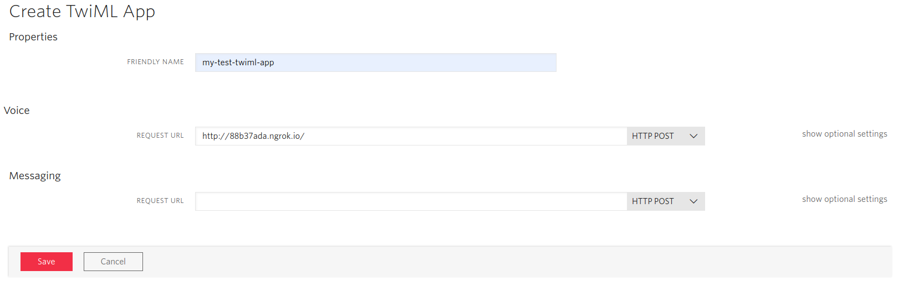
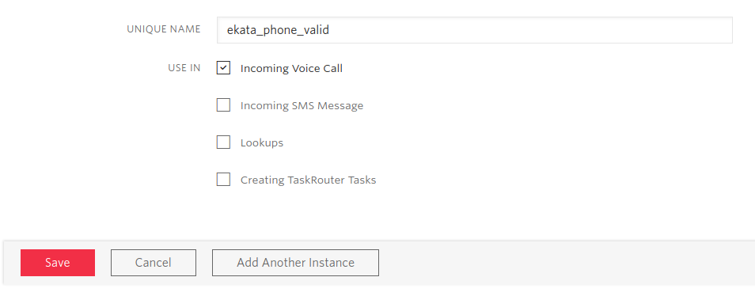

<a href="https://www.twilio.com">
  
</a>

# Block Spam Calls. Powered by Twilio - Python/Flask


> We are currently in the process of updating this sample template. If you are encountering any issues with the sample, please open an issue at [github.com/twilio-labs/code-exchange/issues](https://github.com/twilio-labs/code-exchange/issues) and we'll try to help you.

## About

Learn how to use Twilio add-ons to block spam calls. Learn more about what's needed from this 
[Twilio guide](https://www.twilio.com/docs/guides/block-spam-calls-and-robocalls-python).

Implementations in other languages:

| .NET | Java | Ruby | PHP | Node |
| :--- | :--- | :----- | :-- | :--- |
| [Done](https://github.com/TwilioDevEd/block-spam-calls-csharp) | [Done](https://github.com/TwilioDevEd/block-spam-calls-java)  | [Done](https://github.com/TwilioDevEd/block-spam-calls-ruby)  | [Done](https://github.com/TwilioDevEd/block-spam-calls-php) | [Done](https://github.com/TwilioDevEd/block-spam-calls-node)  |

## Set up

### Requirements

- [python](https://www.python.org/) **3.6**, **3.7** or **3.8** version
- [virtualenv](https://virtualenv.pypa.io)
- [pip](https://pip.pypa.io/)

### Create a TwiML App

This project is configured to use a **TwiML App**, which allows us to easily set the voice URLs for all Twilio phone numbers we purchase in this app.

To create a new TwiML app click [here](https://www.twilio.com/console/voice/twiml/apps).



### Install Add-ons

The following guide will help you to [install Add-ons](https://www.twilio.com/docs/add-ons/install). You can access the Add-ons in the Twilio console [here](https://www.twilio.com/console/add-ons). The Spam Filtering Add-ons that are used on this application are:
- [Ekata Phone Validation](https://showcase.twilio.com/s/partner-listing/a8E1W00000097QEUAY)
- [Marchex Clean Call](https://showcase.twilio.com/s/partner-listing/a8E1W00000097QxUAI)
- [Nomorobo Spam Score](https://showcase.twilio.com/s/partner-listing/a8E1W00000097R7UAI)

Once you've selected the Add-on, just click on `Install` button. Then, you will see a pop-up window where you should read and agree the terms, then, click the button `Agree & Install`. For this application, you just need to handle the incoming voice calls, so make sure the `Incoming Voice Call` box for `Use In` is checked and click `Save`



### Local Development

1. First clone this repository and `cd` into it:

   ```bash
   git clone https://github.com/TwilioDevEd/block-spam-calls-python.git
   cd block-spam-calls-python
   ```

1. Create the virtualenv, load it and install dependencies:

    ```bash
    make install
    ```

1. Run the application (will run on port 5000).

    ```bash
    make serve
    ```

1. To actually forward incoming calls, your development server will need to be publicly accessible. [We recommend using ngrok to solve this problem](https://www.twilio.com/blog/2015/09/6-awesome-reasons-to-use-ngrok-when-testing-webhooks.html).

    ```bash
    ngrok http 5000
    ```

1. Once you have started ngrok, update your [TwiML app's](https://www.twilio.com/console/voice/twiml/apps) Voice URL setting to use your ngrok hostname, so it will look something like this:

    ```bash
    http://88b37ada.ngrok.io/
    ```

That's it!

### Tests

You can run the tests locally by typing

```
python3 test.py
```

### Cloud deployment

Additionally to trying out this application locally, you can deploy it to a variety of host services. Here is a small selection of them.

Please be aware that some of these might charge you for the usage or might make the source code for this application visible to the public. When in doubt research the respective hosting service first.

| Service                           |                                                                                                                                                                                                                           |
| :-------------------------------- | :------------------------------------------------------------------------------------------------------------------------------------------------------------------------------------------------------------------------ |
| [Heroku](https://www.heroku.com/) | [](https://heroku.com/deploy)                                                                                                                                       |

## Resources

- The CodeExchange repository can be found [here](https://github.com/twilio-labs/code-exchange/).

## Contributing

This template is open source and welcomes contributions. All contributions are subject to our [Code of Conduct](https://github.com/twilio-labs/.github/blob/master/CODE_OF_CONDUCT.md).

## License

[MIT](http://www.opensource.org/licenses/mit-license.html)

## Disclaimer

No warranty expressed or implied. Software is as is.

[twilio]: https://www.twilio.com
